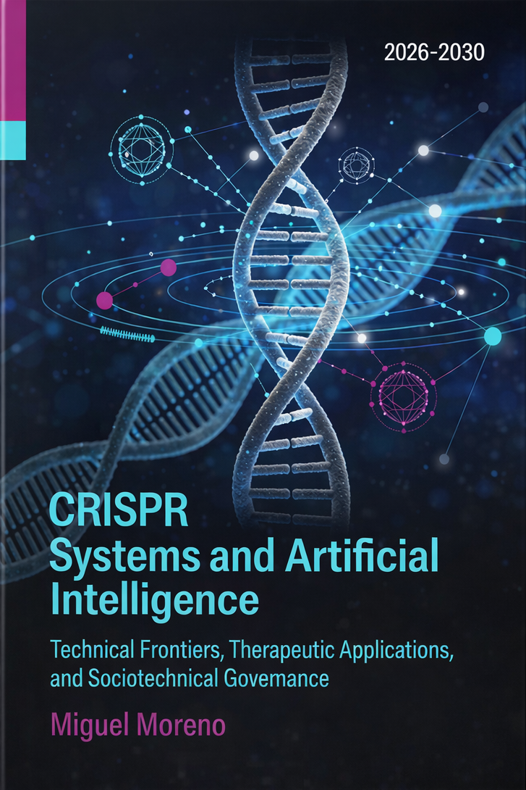

# CRISPR Systems and Artificial Intelligence

**Technical Frontiers, Therapeutic Applications, and Sociotechnical Governance**

[](https://creativecommons.org/licenses/by-nc-sa/4.0/)
[](https://doi.org/10.5281/zenodo.19136685)
[](https://crispr-ai-chi.vercel.app/)
[](https://crispr-ai.netlify.app/)

---

<details>
<summary><strong>Cover</strong></summary>
<br>
<p align="center">
  
</p>
<p align="center"><em>Cover generated with Perplexity; final selection by the author.</em></p>
</details>

---

## Overview

This repository contains the **rendered HTML output** of an academic monograph examining the convergence of CRISPR-based genome editing and artificial intelligence — from molecular mechanism to clinical application to sociotechnical governance.

The monograph (~58,000 words, 384+ bibliographic entries) was authored by Miguel Moreno at the Universidad de Granada as a contribution to several active Horizon Europe and nationally funded research programmes. It is structured as a [Quarto Book](https://quarto.org/docs/books/) rendered to HTML.

> **Note on repository contents.** This repository hosts the **pre-rendered site** (the `_output/` build artefact) for static deployment. It does not include the Quarto source files (`.qmd`), R code, or bibliography sources used during authoring. The archival package — including `.bib` file — is deposited on [Zenodo](https://doi.org/10.5281/zenodo.19136685).

---

## Structure

The monograph is organised in three parts across nine chapters:

### Part I — Technical Foundations

| Ch. | Title |
|:----|:------|
| 1 | CRISPR Architectures: From Cas9 to Epigenome Editors |
| 2 | AI for Guide RNA Design and Off-Target Prediction |
| 3 | AI-Driven Optimisation of Editing Outcomes |

### Part II — Therapeutic Applications

| Ch. | Title |
|:----|:------|
| 4 | Genetic Rare Diseases as Therapeutic Targets for CRISPR-AI |
| 5 | The Clinical Pipeline: From Bench to Bedside |
| 6 | AI Across the Therapeutic Pipeline |

### Part III — Governance and Prospective Analysis

| Ch. | Title |
|:----|:------|
| 7 | Regulatory Frameworks for Gene Editing in Europe and Beyond |
| 8 | Bioethics and STS: Autonomy, Justice, and Sociotechnical Imaginaries |
| 9 | Prospective Scenarios 2026–2030 |

Each Part closes with a *Sociotechnical Interlude* connecting the preceding technical material to broader questions of governance, equity, and epistemic authority.

---

## Deployment

The rendered site is deployed as a static HTML book to:

- **Vercel**: [https://crispr-ai-chi.vercel.app](https://crispr-ai-chi.vercel.app/)
- **Netlify**: [https://crispr-ai.netlify.app](https://crispr-ai.netlify.app/)

Both platforms serve the contents of this repository directly. No build step is required — the HTML is pre-rendered.

### Local preview

To serve the site locally:

```bash
# Any static file server will work
npx serve .
# or
python3 -m http.server 8000
```

Then open `http://localhost:8000` (or the port indicated) in your browser.

---

## Connected research programmes

This monograph contributes to the following funded projects:

| Project | Programme | Grant | Chapters |
|:--------|:----------|:------|:---------|
| **PREDI-LYNCH** | Horizon Europe, Mission on Cancer | 101213916 | 4, 6 |
| **LATE-AYA / PredictAYA** | Horizon Europe | 101214879 | 6 |
| **GRIFOLS-2024** | UGR–Grifols | — | 7, 8 |
| **GRIFOLS-2022** | UGR–Grifols | — | 8 |
| **AUTAI** | MCIN/AEI | PID2022-137953OB-I00 | 8 |

The work also connects to the **EARLYSCAN** cluster (PREDI-LYNCH + SHIELD + DISARM), a Horizon Europe initiative for early detection of heritable cancers.

---

## Authorship and methodology

**Author of record**: Miguel Moreno · Universidad de Granada · [ORCID 0000-0002-0746-9587](https://orcid.org/0000-0002-0746-9587)

This monograph was produced through a **hybrid human–AI collaboration**, documented transparently in the preface. The division of labour was as follows:

- **Conceptual direction, STS/bioethics framework, editorial decisions, and final validation**: Miguel Moreno (UGR).
- **Practical recommendations for experimental verification of CRISPR systems (Part I), identification of preprints and grey literature**: predoctoral collaborators with direct laboratory experience in biomedical CRISPR applications.
- **Literature synthesis, argumentative architecture, academic prose drafting (British English), R/ggplot2 code generation, bibliography construction, and longitudinal document coherence**: Claude (Anthropic; models: Claude Sonnet 4.6 and Claude Opus 4.6).

All bibliographic entries were independently verified by a human collaborator. Entries whose exact data could not be confirmed were tagged `[PENDIENTE VERIFICACIÓN]` and resolved before publication. A lexical audit (R script) was applied across all nine chapters to identify and revise formulaic connectors, overrepresented lexical items, and structural inconsistencies.

The methodology is described in full in the monograph's preface. The use of AI as a collaborative tool is a deliberate methodological choice aligned with emerging norms for responsible AI-assisted scholarship.

---

## Citation

```bibtex
@book{moreno2026crispr,
  author    = {Moreno, Miguel},
  title     = {{CRISPR Systems and Artificial Intelligence: Technical Frontiers, Therapeutic Applications, and Sociotechnical Governance}},
  year      = {2026},
  publisher = {Universidad de Granada},
  doi       = {10.5281/zenodo.XXXXXXX},
  url       = {https://crispr-ai-chi.vercel.app/},
  note      = {Quarto Book, HTML edition}
}
```

---

## Licence

This work is licensed under [Creative Commons Attribution-NonCommercial-ShareAlike 4.0 International (CC BY-NC-SA 4.0)](https://creativecommons.org/licenses/by-nc-sa/4.0/).

You are free to share and adapt this material for non-commercial purposes, provided you give appropriate credit, indicate any changes made, and distribute derivative works under the same licence.

---

## Archival deposit

The complete project archive — including `references.bib` and rendered outputs — is preserved on Zenodo:

> **DOI**: [10.5281/zenodo.XXXXXXX](https://doi.org/10.5281/zenodo.XXXXXXX)

The Zenodo deposit constitutes the version of record for archival and reproducibility purposes.
